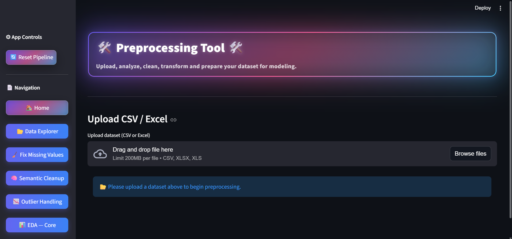

# 🛠️ Preprocessing Tool  
### Smart Data Cleaning, Transformation & EDA Web App

**Preprocessing Tool** is a modern, Streamlit-based web application designed to clean, explore, transform, and prepare messy real-world datasets for machine learning and analytics.

The app follows a **guided, end-to-end preprocessing workflow**, making it suitable for:
- Data Analysts  
- Machine Learning Engineers  
- Data Science Students  

---

## 🚀 Live App
🔗 **Live Application**: https://preprocessing-tool.streamlit.app/

> The live demo is deployed on Streamlit Cloud and currently runs from a dedicated testing branch (`deploy-test`) for UI validation and iteration.  
> The `main` branch contains the stable and reviewed version of the codebase.
---

## 🔄 Workflow

1️⃣ Upload Dataset  
2️⃣ Fix Missing Values  
3️⃣ Semantic Cleanup  
4️⃣ Outlier Handling  
5️⃣ Exploratory Data Analysis (EDA)  
6️⃣ Encoding & Transformation  
7️⃣ Correlation Cleanup  
8️⃣ PCA (optional)  
9️⃣ Download Clean Dataset  

---

## ✨ Key Features

- **Automatic & Manual Missing Value Handling**
- **Semantic Cleanup**  
  Fix mixed data types, units, ranges, patterns, and inconsistencies
- **Outlier Detection & Treatment**  
  IQR, Z-Score, and manual threshold methods
- **Skewness Correction**  
  Log, Square-Root, and Reciprocal transformations
- **Categorical Encoding**  
  Label Encoding, One-Hot Encoding, Manual Mapping
- **Correlation Handling**  
  Detect and manage highly correlated features
- **Dimensionality Reduction**  
  PCA (manual and variance-based)
- **EDA Auto-Charts**  
  Histograms, Boxplots, Num–Num, Num–Cat, and Cat–Cat visualizations
- **Download Center**  
  Export cleaned datasets and preprocessing summaries

---

## 📸 App Overview
### Home

---
## 🔧 Preprocessing Flow
- Structured multi-page pipeline
- Automatic data-type detection
- Interactive previews before applying changes
- Before/after comparison at every step
- Undo support for safe experimentation

## 📊 Outputs
- Clean, ML-ready dataset
- EDA summaries and visualizations
- Encoded & transformed features
- PCA components (optional)

---

## ⚙️ Tech Stack

- **Streamlit** — Web application & workflow UI  
- **Pandas, NumPy** — Data manipulation & cleaning  
- **scikit-learn** — Encoding, scaling, PCA  
- **Plotly** — Interactive EDA visualizations  
- **ReportLab** — Summary report generation  

---

## ▶️ Run Locally

- git clone https://github.com/Techy-Tushar/Preprocessing-Tool
- cd Preprocessing-Tool
- pip install -r requirements.txt
- streamlit run app.py

---

## 🛠 Future Enhancements

- Smarter semantic cleanup with automated normalization and unit handling

- Advanced EDA exports (PDF / HTML), heatmaps, and multivariate insights

- Universal dataset conversion across formats (CSV, Excel, JSON, Parquet, SQL-ready)

- Scalable web application with improved UI/UX and large-data performance

- Mobile-friendly and offline-capable version for local and secure environments

---

## 📁 Project Structure

- Preprocessing-Tool/
- │── app.py
- │── requirements.txt
- │── README.md
- │── app_pages/
- │── utils/

---

## 🧑‍💻 Ownership & License
- Preprocessing Tool is originally designed and implemented by
- Tushar Rathod.

- This project is released under the MIT License.
- Any reuse, modification, or distribution must retain the original license
and attribution.

---

## 📬 Contact
- GitHub: https://github.com/Techy-Tushar

- LinkedIn: https://www.linkedin.com/in/tusharathod/
